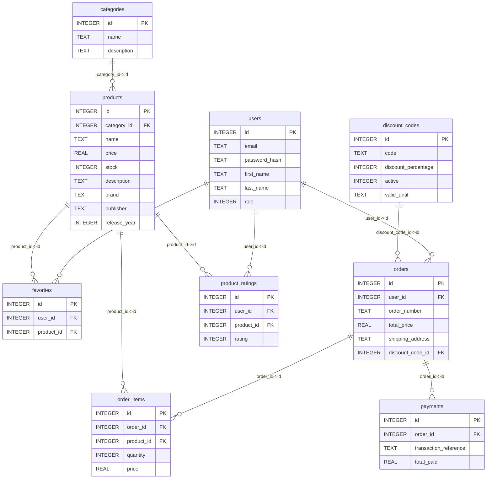

# Database Models and Relations

Generated at: 2026-03-27 09:38:05 UTC

## categories

| Column | Type | Not Null | PK | Default |
|---|---|---|---|---|
| id | INTEGER | No | Yes |  |
| name | TEXT | Yes | No |  |
| description | TEXT | No | No |  |

## discount_codes

| Column | Type | Not Null | PK | Default |
|---|---|---|---|---|
| id | INTEGER | No | Yes |  |
| code | TEXT | Yes | No |  |
| discount_percentage | INTEGER | Yes | No |  |
| active | INTEGER | Yes | No |  |
| valid_until | TEXT | Yes | No |  |

## favorites

| Column | Type | Not Null | PK | Default |
|---|---|---|---|---|
| id | INTEGER | No | Yes |  |
| user_id | INTEGER | Yes | No |  |
| product_id | INTEGER | Yes | No |  |

Relations:
- favorites.product_id -> products.id
- favorites.user_id -> users.id

## order_items

| Column | Type | Not Null | PK | Default |
|---|---|---|---|---|
| id | INTEGER | No | Yes |  |
| order_id | INTEGER | Yes | No |  |
| product_id | INTEGER | Yes | No |  |
| quantity | INTEGER | Yes | No |  |
| price | REAL | Yes | No |  |

Relations:
- order_items.product_id -> products.id
- order_items.order_id -> orders.id

## orders

| Column | Type | Not Null | PK | Default |
|---|---|---|---|---|
| id | INTEGER | No | Yes |  |
| user_id | INTEGER | Yes | No |  |
| order_number | TEXT | Yes | No |  |
| total_price | REAL | Yes | No |  |
| shipping_address | TEXT | Yes | No |  |
| discount_code_id | INTEGER | No | No |  |

Relations:
- orders.discount_code_id -> discount_codes.id
- orders.user_id -> users.id

## payments

| Column | Type | Not Null | PK | Default |
|---|---|---|---|---|
| id | INTEGER | No | Yes |  |
| order_id | INTEGER | Yes | No |  |
| transaction_reference | TEXT | Yes | No |  |
| total_paid | REAL | Yes | No |  |

Relations:
- payments.order_id -> orders.id

## product_ratings

| Column | Type | Not Null | PK | Default |
|---|---|---|---|---|
| id | INTEGER | No | Yes |  |
| user_id | INTEGER | Yes | No |  |
| product_id | INTEGER | Yes | No |  |
| rating | INTEGER | Yes | No |  |

Relations:
- product_ratings.product_id -> products.id
- product_ratings.user_id -> users.id

## products

| Column | Type | Not Null | PK | Default |
|---|---|---|---|---|
| id | INTEGER | No | Yes |  |
| category_id | INTEGER | Yes | No |  |
| name | TEXT | Yes | No |  |
| price | REAL | Yes | No |  |
| stock | INTEGER | Yes | No |  |
| description | TEXT | No | No |  |
| brand | TEXT | No | No |  |
| publisher | TEXT | No | No |  |
| release_year | INTEGER | No | No |  |

Relations:
- products.category_id -> categories.id

## users

| Column | Type | Not Null | PK | Default |
|---|---|---|---|---|
| id | INTEGER | No | Yes |  |
| email | TEXT | Yes | No |  |
| password_hash | TEXT | Yes | No |  |
| first_name | TEXT | No | No |  |
| last_name | TEXT | No | No |  |
| role | INTEGER | Yes | No |  |

## ER Diagram (Mermaid)

